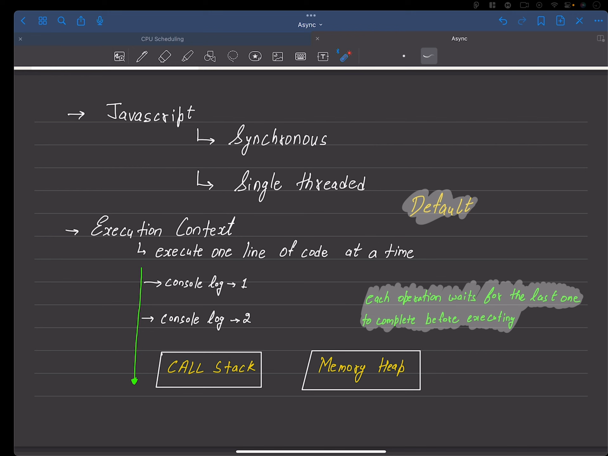
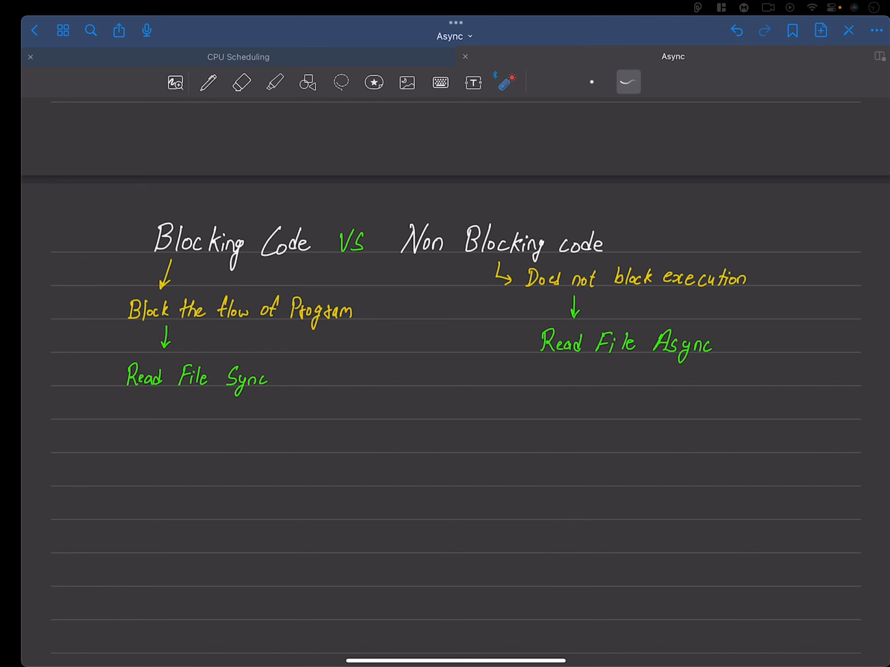
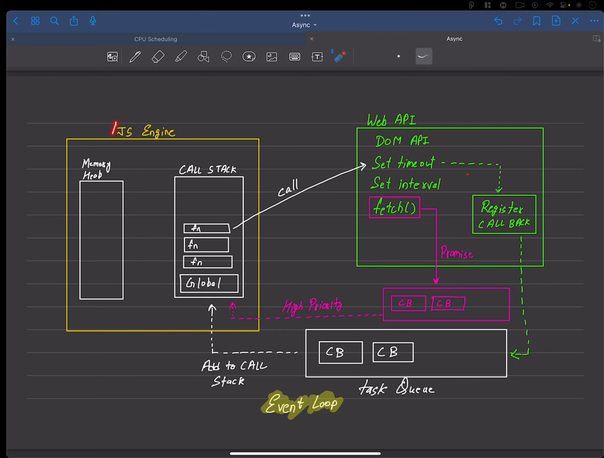

# Asyncronouse code
## Introduction: 

- setTimeOut(), setInterval(), clearTimeOut(), clearInterval(), web API.
- these part of Asyn code.

- js k jo by default asyn nahi he use bannana padta he. j se ki kuch API or setTimeOut  jese KO USE Kark banana padta he.

- js k jo default engine he  browser ka  he vo asyn nahi he  JS KA  .

- PAR,  complite js ka run time environment he vo Asyncronous JS KO  allowed(bana hua hota he) karta he.

- KI JO 1 HI THRED PAR WORK KARTA HE, IT'S AWSOME.


# Notes js

## js is a sycronouse : 1 code after 1 code execute 

type of js
 - syncronouse : java sccript ka jo 
 - single threaded 
 

## syncronouse = Blocking Code
## Asyncronouse = Non - Blocking Code 



# js Engine



# SetTimeOut():
- handler jisme function ka refrence chalta he, function ko execute mata kar dena like,
 ```javascript
    const setTime = function(){
        console.log("Bhavesh Malvi");
    }
    setTimeout(setTime,2000)
 ```

 , function , callback function are remaining something same.

## Example:
 
 ```javascript
 console.log("bhavesh");
 
 ```


