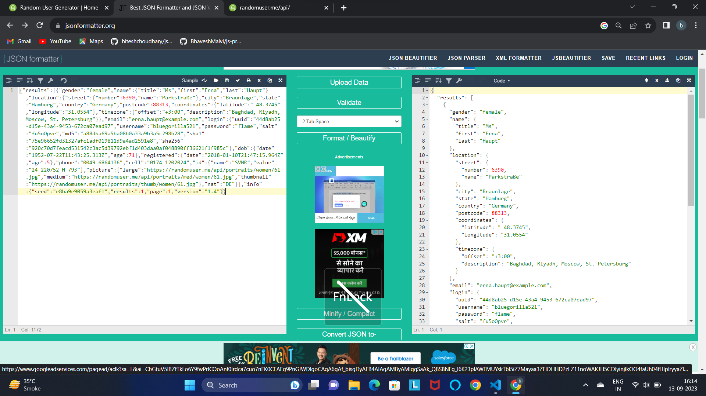

# Advance js Topics
# API
## Introduction:
- Api  k jo talking language he jo 2 system k bich me.
- jo 2 system backennd bhi ho sakta he or front end bhi ho sakta he.
## Example:
## randomuser: https://randomuser.me/

## json formater : https://jsonformatter.org/
### img:

# introduction of Console:
- console techniqaly js ka part he bhi or nahi bhi.
- console ek type ka debugger or dev tool (Browser ka devloper tool) he. jo run time eenvironment me milta he.
- js k jo c++ se run hoti he.
- if more search on like V8.
- V8 jha sare js k engine work hota he use 1 wrapper me rrakha jata he. jo as like part, 
- API  JO C++ OR JS ko serve karta he throught API.
