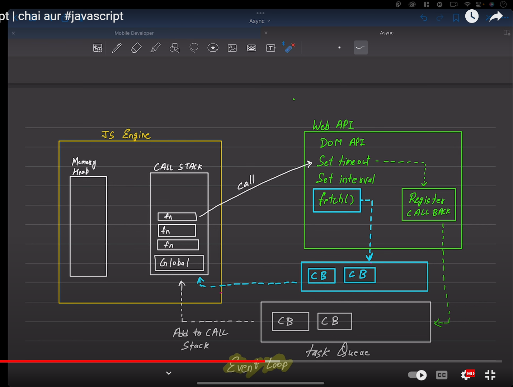
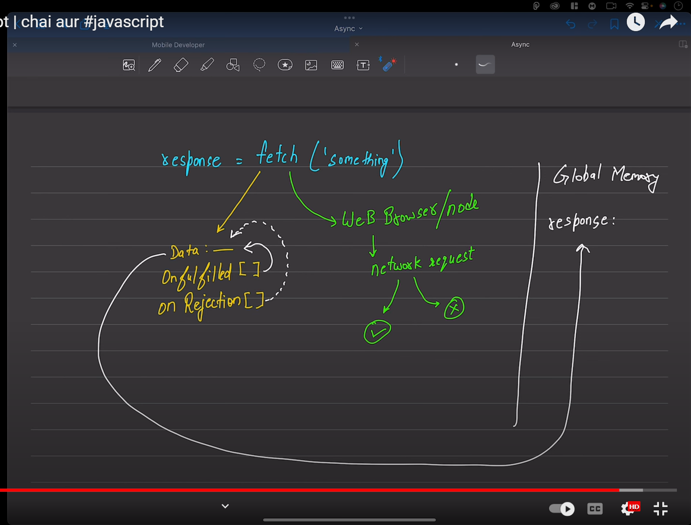

# fetch() API
## INTRODUCTION:
-  The global fetch() method starts the process of fetching a resource from the network, returning a promise which is fulfilled once the response is available. 

- fetch API me jab apko error code 404 milega vo kha par milega. resolve ya reject me milega ????
- Error 404 always response me hi milega. this is not a error it is request accept as network.

- more etails link : https://developer.mozilla.org/en-US/docs/Web/API/fetch
- first priority is very high after setTimeOut, setInterval .

