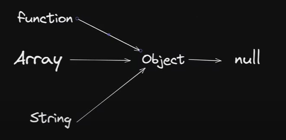

# This ( jisne bulaya this challl aya.....!!!!! )

## jisne call ki ya to this pachonch gya udi bababababa reeeeee.......

# Prototype

- js ka jo default behaviour he vo protoype behaviour he.
- jab use ko chij nahi milti tab vo uper puer layer me jake search karti jab tak use null value na mile.
- isise link hoke this, arrow jisme this keyword nahi hota jo prototype se link he.
- so prototype hi he jo new krywork ,ya workings use mile ye, classes , this, prototype clss heritance, inheritance, un sabka excess isss se hi milta he.
- so jab tak stisfide naho tab tak vo inside deeply search karta he.

inshort araay, string, function ko techniqaly object he jiska refrence finally null milta he om prototype .

