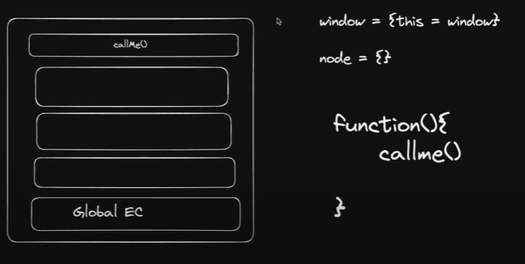

## function k ander function ate he tab...

- execution context
- globle execution context
- .
- .
- function inside a callme function
## proble: callme() me jab this use karte he tab kis ko execute katra he ???
- isss case me This key word globle context ko execute karta he...
- par globle executin me proble me ki jab window object me ho tab window object ko eexecute karta he.
- node me jab hoto use me to koi environent hota nahi to vo empty object show karta he.
  - window = **{ this.window }**
  - node = **{ }**
